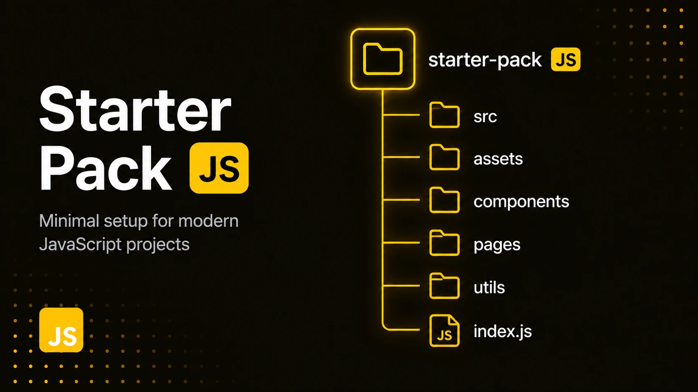

<!-- # Starter Pack JS -->

<p align="center">
  
</p>

Шаблон для создания frontend-проектов на JavaScript.

Включает базовую настройку инструментов разработки:

- Vite
- ESLint
- Prettier
- EditorConfig
- Vitest
- Husky
- lint-staged
- Commitlint
- GitHub Actions
- GitHub Templates
- Dependabot
- Validate Branch Name

---

# Стек

- JavaScript
- Vite
- ESLint
- Prettier
- Vitest

---

# Быстрый старт

## Установка зависимостей

```
npm install
```

## Запуск проекта

```
npm run dev
```

## Production-сборка

```
npm run build
```

## Просмотр сборки

```
npm run preview
```

## Проверка кода

ESLint:

```
npm run lint
```

Форматирование:

```
npm run format
```

Тесты:

```
npm run test
```

---

### Названия веток

Используется `validate-branch-name`.

Формат:

`<type>/<description>`
`<type>/<issue-number>-<description>`

Примеры:

feat/add-login-form
experiment/state-kit
chore/update-eslint

или

`feat/117-add-login-form`
`fix/225-fix-validation`
`docs/228-update-readme`

Допустимые типы:

`build`, `chore`, `ci`, `docs`, `feat`, `fix`, `perf`, `refactor`, `revert`, `style`, `test`, `experiment`

Проверка выполняется автоматически перед `git push`.

---

# Структура проекта

```
.
├── public/
│   ├── images/
│   ├── favicon.ico
│   ├── site.webmanifest
│   └── robots.txt
│
├── .github/
│   ├── workflows/
│   └── dependabot.yml
│
├── .husky/
│
├── index.html
├── package.json
└── README.md
```

---

## Архитектура

Проект использует **Feature-Sliced Design (FSD)**.

Основная структура:

```text
src/
├── app/
├── pages/
├── widgets/
├── features/
├── entities/
├── shared/
└── main.js
```

`main.js` является точкой входа приложения.

Подробная памятка по FSD находится в [`docs/fsd/fsd.md`](docs/fsd/fsd.md).

---

# Перед началом нового проекта

После копирования шаблона необходимо заменить заглушки.

## HTML

- [ ] Изменить title
- [ ] Обновить meta description
- [ ] Обновить автора проекта
- [ ] Проверить язык страницы

## Open Graph

- [ ] Изменить og:title
- [ ] Изменить og:description
- [ ] Заменить og:image
- [ ] Изменить og:url

## Иконки

- [ ] Сгенерировать новые favicon
- [ ] Заменить:

  - favicon.ico
  - favicon-16x16.png
  - favicon-32x32.png
  - apple-touch-icon.png
  - android-chrome-192x192.png
  - android-chrome-512x512.png

## PWA

- [ ] Обновить site.webmanifest
- [ ] Изменить:

  - name
  - short_name
  - theme_color
  - background_color

## GitHub

- [ ] Изменить описание репозитория
- [ ] Обновить README
- [ ] Проверить GitHub Actions
- [ ] Проверить Dependabot

---

# Git workflow

Перед каждым коммитом через Husky и lint-staged выполняются:

- ESLint (`eslint --fix`)
- Prettier (`prettier --write`)
- Commitlint (проверка сообщения коммита)

Используется соглашение **Conventional Commits**.

### Примеры

✅ Корректно:

```text
feat: add modal component
fix: resolve race condition
docs: update readme
refactor: simplify state manager
test: add unit tests
chore: update dependencies
ci: add github actions
```

❌ Некорректно:

```text
update
fixed bug
new feature
changes
```

---

## Шаблоны GitHub

В репозитории настроены шаблоны для стандартизации работы с GitHub:

- **Issues** — шаблоны для ошибок, функций и других задач.
- **Pull Requests** — шаблон описания изменений, тестирования и проверки перед слиянием.

Шаблоны находятся в директории `.github/`. GitHub автоматически использует их при создании новых Issues и Pull Requests.

---

# Команды разработки

| Команда            | Назначение         |
| ------------------ | ------------------ |
| npm run dev        | запуск dev-сервера |
| npm run build      | production-сборка  |
| npm run preview    | просмотр сборки    |
| npm run lint       | проверка ESLint    |
| npm run format     | форматирование     |
| npm run test       | запуск тестов      |
| npm run test:watch | запуск тестов      |

---

# Лицензия

MIT
